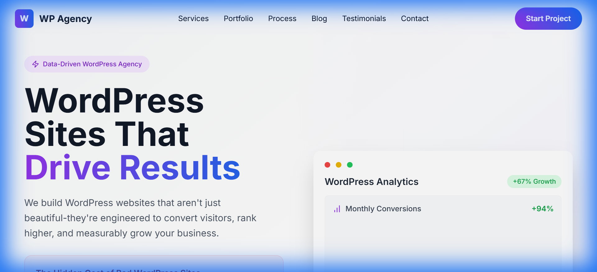

# React Pulse Robot

An accessible WordPress showcase template with Lottie animations and data-driven design.

[](./LICENSE)
[](https://react.dev)
[](https://lottiefiles.com)
[](https://vitejs.dev)
[](https://tailwindcss.com)
[](https://www.typescriptlang.org)
[](https://www.radix-ui.com)



> **[Live Demo →](https://pulse-robot.wpagency.space)**

## Features

- **Lottie React animations** - Performant JSON-based animations for engaging interactions
- **Accessibility-first with Radix UI** - WCAG 2.1 compliant components with proper ARIA attributes
- **WordPress-focused content sections** - Pre-built templates for WordPress service pages
- **Data-driven statistics and metrics** - Display impressive stats with animated counters
- **WooCommerce showcase components** - Beautiful product and store showcase templates
- **Performance optimization guides** - Built-in blog section with optimization tutorials
- **Free website audit CTA** - Call-to-action components for lead generation
- **Blog and case study templates** - Rich content templates for articles and case studies
- **SEO and analytics integration** - Meta tags, Open Graph, and analytics ready
- **Light/modern design aesthetic** - Clean, professional design suitable for agencies and consultants

## Quick Start

```bash
# Clone the repository
git clone https://github.com/wpagency/react-pulse-robot.git

# Navigate to the project
cd react-pulse-robot

# Install dependencies
npm install

# Start development server
npm run dev
```

Open [http://localhost:5173](http://localhost:5173) in your browser.

## Tech Stack

| Technology | Purpose |
|-----------|---------|
| React 18.3.1 | UI framework with hooks and concurrent features |
| Lottie React 2.4.0 | Lightweight animation library for JSON animations |
| Radix UI (20+ components) | Accessible, unstyled component primitives |
| Vite 5.4.1 | Next-generation frontend build tool |
| Tailwind CSS 3.4.11 | Utility-first CSS framework |
| React Router v6 | Client-side routing for single-page application |
| React Hook Form 7.x | Performant, flexible form library |
| Zod | TypeScript-first schema validation |
| TypeScript 5.5.3 | Typed superset of JavaScript |

## Project Structure

```
react-pulse-robot/
├── src/
│   ├── components/        # UI components and layouts
│   ├── pages/             # Route pages (Home, Blog, Services, etc.)
│   ├── animations/        # Lottie animation files and configs
│   ├── hooks/             # Custom React hooks
│   ├── lib/               # Utility functions and helpers
│   ├── types/             # TypeScript definitions
│   └── App.tsx            # Main application component
├── public/                # Static assets and screenshots
├── index.html             # HTML entry point
├── vite.config.ts         # Vite configuration
├── tailwind.config.ts     # Tailwind CSS theme config
└── tsconfig.json          # TypeScript configuration
```

## Environment Variables

Copy `.env.example` to `.env.local` and fill in your values:

```bash
cp .env.example .env.local
```

See [.env.example](./.env.example) for all available options.

## Scripts

| Command | Description |
|---------|------------|
| `npm run dev` | Start development server with hot reload |
| `npm run build` | Build for production with optimizations |
| `npm run preview` | Preview production build locally |
| `npm run lint` | Run ESLint to check code quality |
| `npm run type-check` | Check TypeScript types |

## Customization

### Colors and Typography

Edit the color palette and typography in `tailwind.config.ts` or `src/index.css` to match your brand. The theme is designed to be professional and accessible.

### Lottie Animations

Replace Lottie animation files in the `/public/animations/` directory. Update component imports to use new animations:

```tsx
import Lottie from 'lottie-react';
import animationData from '@/animations/your-animation.json';

export function AnimatedSection() {
  return <Lottie animationData={animationData} loop autoplay />;
}
```

### WordPress Content

Customize the WordPress showcase sections in `/src/pages/` and `/src/components/`. Add your own case studies, services, and testimonials:

```tsx
// Example: Services section
export function WordPressServices() {
  const services = [
    { title: 'Website Design', description: '...' },
    { title: 'WordPress Development', description: '...' },
    // ... more services
  ];
  return (
    <section>
      {services.map(service => (
        <ServiceCard key={service.title} {...service} />
      ))}
    </section>
  );
}
```

### Statistics and Data

Update metrics in data files or directly in components. Use animated counters for impressive displays:

```tsx
export function Stats() {
  return (
    <div>
      <StatCounter label="Happy Clients" value={150} />
      <StatCounter label="Projects Completed" value={500} />
      <StatCounter label="Years Experience" value={15} />
    </div>
  );
}
```

## Other Themes in This Collection

| Theme | Description | Demo |
|-------|------------|------|
| [Astro Brutalfolio](https://github.com/wpagency/astro-brutalfolio) | Brutalist multilingual portfolio | [Demo](https://brutalfolio.wpagency.space) |
| [Astro Romance](https://github.com/wpagency/astro-romance) | Romantic pink agency theme | [Demo](https://astro-romance.wpagency.space) |
| [Astro Starter](https://github.com/wpagency/astro-starter) | Full-featured Astro starter with Three.js | [Demo](https://astro-starter.wpagency.space) |
| [React Agency Genesis](https://github.com/wpagency/react-agency-genesis) | Premium agency funnel template | [Demo](https://agency-genesis.wpagency.space) |
| [React Parallax Foundry](https://github.com/wpagency/react-parallax-foundry) | 3D parallax website with R3F | [Demo](https://parallax-foundry.wpagency.space) |
| [React Rescue Odyssey](https://github.com/wpagency/react-rescue-odyssey) | Story-driven space theme with Supabase | [Demo](https://rescue-odyssey.wpagency.space) |
| [React Source Seeker](https://github.com/wpagency/react-source-seeker) | Interactive 3D storytelling with PWA | [Demo](https://source-seeker.wpagency.space) |

## Contributing

Contributions are welcome! Please see [CONTRIBUTING.md](./CONTRIBUTING.md) for guidelines.

## License

MIT License — see [LICENSE](./LICENSE) for details.

---

### Built by [WP Agency](https://wpagency.xyz) — WordPress and Beyond

With 15+ years of agency experience, we build production websites that perform. These open-source themes represent our commitment to the developer community.

**Need customization or a production build?** [Let's talk →](https://wpagency.xyz/contact)
